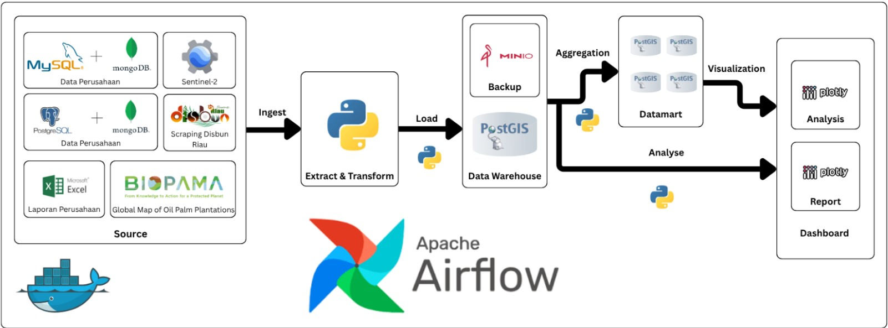
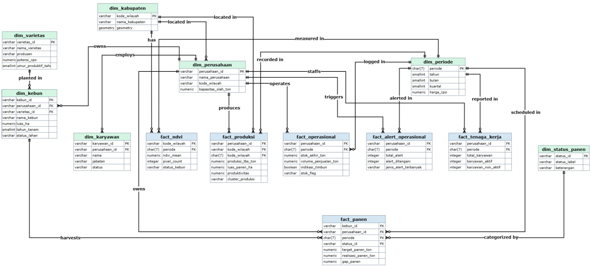

# SAVI (Sawit Vision) - Provinsi Riau

<p align="center">
  
</p>

<p align="center">
  
  
  
  
  
  
  
  
</p>

## Pendahuluan
**SAVI (Sawit Vision)** adalah sebuah *Decision Support System* (DSS) terintegrasi yang dirancang untuk mengawasi operasional perkebunan dan industri kelapa sawit di seluruh kabupaten Provinsi Riau. Sistem ini mengintegrasikan data dari berbagai sumber heterogen (Database OLTP Perusahaan, Citra Satelit GEE, dan MongoDB) ke dalam sebuah Data Warehouse berbasis PostGIS untuk menghasilkan analisis strategis yang akurat dan *real-time*.

### Tujuan Proyek
Tujuan utama dari proyek ini adalah membangun *Decision Support System* (DSS) untuk pengawasan perkebunan kelapa sawit di Provinsi Riau melalui platform SAVI. Secara spesifik, tujuan analisis yang ingin dicapai adalah sebagai berikut:

1.  **Klasifikasi Kesehatan Vegetasi**: Memantau dan mengklasifikasikan kesehatan vegetasi kebun sawit per kabupaten/kota di Provinsi Riau berdasarkan analisis deret waktu NDVI untuk memberikan rekomendasi area yang membutuhkan intervensi atau *replanting*.
2.  **Analisis Produktivitas PKS**: Mengklasifikasikan produktivitas PKS di Provinsi Riau menjadi *cluster* kinerja (*underperform*, *average*, *overperform*) menggunakan algoritma K-Means untuk mendeteksi pabrik yang memiliki kinerja rendah secara konsisten.
3.  **Deteksi Anomali Rantai Pasok**: Mengembangkan logika deteksi otomatis (*rule-based*) untuk mengidentifikasi indikasi anomali rantai pasok di mana perusahaan menahan volume penjualan (*hoarding*) ketika terjadi tren penurunan harga CPO di pasar resmi.
4.  **Evaluasi Pencapaian Target**: Mengklasifikasikan tingkat pencapaian realisasi panen terhadap target pada level blok kebun dan varietas tanaman untuk mengidentifikasi unit kebun yang secara konsisten berada pada kategori *underperform*, serta menganalisis apakah pola tersebut bersifat sistematis berdasarkan karakteristik varietas.

---

## Arsitektur Sistem
Sistem ini dibangun dengan pendekatan *Data Pipeline* yang terotomatisasi menggunakan Apache Airflow. Alur data dimulai dari ekstraksi multi-sumber, transformasi berbasis logika bisnis, hingga penyajian data melalui *Materialized Views*.

### Alur Kerja ETL hingga Visualisasi


1.  **Ingestion Layer**: Ekstraksi data dari 12 sistem database PKS (MySQL & PostgreSQL), dokumen log operasional (MongoDB), serta pengambilan data citra satelit Sentinel-2 melalui API Google Earth Engine.
2.  **Storage Layer**: Penyimpanan data terpusat pada PostgreSQL (PostGIS) menggunakan model **Galaxy Schema**.
3.  **Analytics Layer**: Eksekusi algoritma Machine Learning (K-Means Clustering) dan *Rule-Based System* untuk evaluasi kinerja.
4.  **Serving Layer**: Penyajian data melalui *Datamart* yang dioptimalkan untuk visualisasi interaktif pada Dashboard.

---

## Desain Data Warehouse: Galaxy Schema
Pusat data sistem ini menggunakan pemodelan **Galaxy Schema (Fact Constellation)** untuk mengakomodasi berbagai proses bisnis yang berbeda namun tetap berbagi dimensi yang sama (*Conformed Dimensions*).



Model ini terdiri dari beberapa tabel fakta utama:
-   **Fact NDVI**: Memantau kesehatan vegetasi berdasarkan koordinat geospasial.
-   **Fact Produksi**: Mengukur produktivitas TBS (Ton/Ha) dan klasifikasi cluster.
-   **Fact Operasional**: Analisis stok dan deteksi indikasi penimbunan.
-   **Fact Panen**: Evaluasi realisasi versus target panen di tingkat blok.

---

## Sumber Data
Sistem SAVI mengintegrasikan data dari berbagai penyedia layanan untuk menghasilkan analisis yang menjawab tujuan proyek :
-   **12 Database OLTP Perusahaan**: Data operasional harian yang tersebar di mesin MySQL dan PostgreSQL dari 12 PKS di Riau.
-   **Google Earth Engine (GEE)**: Ekstraksi citra satelit Sentinel-2 untuk analisis vegetasi (NDVI).
-   **MongoDB (Log Operasional)**: Penyimpanan log sistem semi-terstruktur (BSON/JSON) untuk data peringatan mesin.
-   **Web Scraping (Disbun Riau)**: Pengambilan data harga CPO mingguan dari portal resmi pemerintah Provinsi Riau.
-   **Flat Files (Excel/CSV)**: Akomodasi data laporan historis dan manual dari pihak perusahaan.

---

## Orkestrasi Pipeline (DAGs)
Seluruh proses bisnis di SAVI diatur oleh 8 unit DAG (*Directed Acyclic Graph*) pada Apache Airflow:
1.  **`dag1_ndvi_extraction`**: Mengelola interaksi dengan GEE untuk ekstraksi nilai NDVI kabupaten.
2.  **`dag2_produksi_etl`**: Pipeline ELT raksasa yang menormalisasi data dari 12 database PKS yang heterogen.
3.  **`dag3_harga_cpo`**: Melakukan scraping otomatis terhadap harga acuan CPO pasar Riau.
4.  **`dag4_analitik`**: Menjalankan model K-Means *clustering* dan logika deteksi penimbunan pada DWH.
5.  **`dag5_panen_etl`**: Menarik data realisasi panen mikro dari sistem operasional lapangan.
6.  **`dag6_alert_etl`**: Mentransformasi dokumen MongoDB menjadi tabel relasional untuk analisis *downtime*.
7.  **`dag7_datamart_refresh`**: Memperbarui *Materialized Views* di layer Datamart sesaat setelah ETL selesai.
8.  **`dag8_minio_backup`**: Prosedur pencadangan otomatis (dump) basis data DWH ke sistem *Object Storage* MinIO.

---

## Stack Teknologi
-   **Orchestration**: Apache Airflow
-   **Containerization**: Docker & Docker Compose
-   **Database**: PostgreSQL (PostGIS), MySQL, MongoDB
-   **Data Processing**: Python (Pandas, Scikit-learn, GEE API)
-   **Visualization**: Plotly Dash (Web App)
-   **Object Storage**: MinIO (Backup & Archive)

---

## Persiapan Instalasi

### Prasyarat
-   Docker & Docker Compose
-   Akun Google Earth Engine (GEE) untuk akses citra satelit

### Langkah-langkah
1.  **Clone Repository**
    ```bash
    git clone https://github.com/username/sawit-riau.git
    cd sawit-riau
    ```

2.  **Konfigurasi Environment**
    Salin file `.env.example` menjadi `.env` dan sesuaikan kredensial Anda.
    ```bash
    cp .env.example .env
    ```

3.  **Konfigurasi GEE**
    Masukkan kredensial Google Earth Engine Anda ke dalam file `gee-credentials.json` (Gunakan `gee-credentials.json.example` sebagai referensi).

4.  **Menjalankan Sistem**
    Gunakan Docker Compose untuk membangun dan menjalankan seluruh kontainer.
    ```bash
    docker-compose up -d --build
    ```

### Akses Antarmuka & Kredensial Default
Setelah sistem berjalan, Anda dapat mengakses berbagai layanan melalui URL dan kredensial default berikut:

| Layanan | URL | Username / Email | Password |
| :--- | :--- | :--- | :--- |
| **SAVI Dashboard** | [http://localhost:8050](http://localhost:8050) | - (Public) | - (Public) |
| **Apache Airflow** | [http://localhost:8080](http://localhost:8080) | `admin` | `admin` |
| **pgAdmin (DWH GUI)** | [http://localhost:5050](http://localhost:5050) | `admin@admin.com` | `admin` |
| **MinIO Console** | [http://localhost:9090](http://localhost:9090) | `minio` | `minio123` |

---
*Laporan ini merupakan bagian dari Proyek Teknologi Perekayasaan Data - STIS 2026.*
